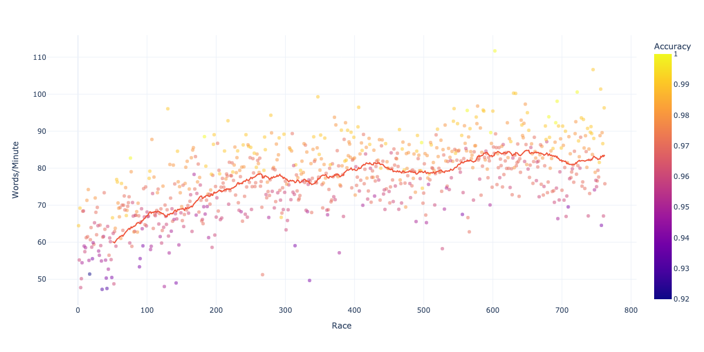

# Typeracer: Analyse and plot user & text data

This package allows you to scrape, analyse, and plot user and text data. 


## Installation: 

```
pip install -r requirements.txt
```

## Download data: 

### Download user data: 
To download user data, run: 
```
python3 -m get_races -u abnf
```

You can also download only a specific number of last races. E.g. to download the last 100 races, run: 
```
python3 -m get_races -u abnf -lr 100
```

### Download text data: 
To download text data, run: 
```
python3 -m get_texts 
```

Instead of downloading the full texts, you can also download the abbreviated texts by running: 
```
python3 -m get_texts --no-feature 
```


## Plot data

To generate user plots, run: 
```
python3 -m visualizer -u abnf
```
This will generate a **scatter plot** of the words-per-minute for user abnf across all races, as well as a histogram comparing the user's performance to the average speed across all texts. 


